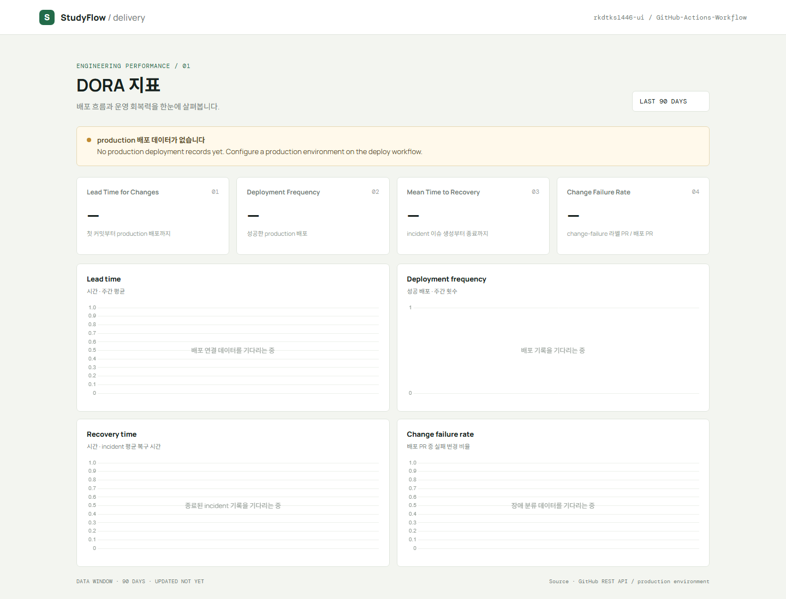

# GitHub Actions DORA Metrics

GitHub Actions 기반으로 DORA 4대 지표를 수집하고 Chart.js 대시보드와 주간 Markdown 보고서를 생성하는 예제 저장소입니다.



## DORA 지표

| 지표 | 계산 기준 |
| --- | --- |
| Lead Time for Changes | PR 첫 커밋부터 해당 변경을 포함한 첫 성공 production 배포까지 |
| Deployment Frequency | 성공한 production 배포 횟수/주 |
| MTTR | `incident` 라벨 이슈 생성부터 종료까지의 평균 시간 |
| Change Failure Rate | `change-failure` 라벨이 붙은 배포 PR / 배포 연결 PR |

## 자동화 흐름

`.github/workflows/dora-metrics.yml`이 다음 작업을 수행합니다.

1. 매일 UTC 02:17, production 배포 성공, 또는 수동 실행 시 최근 90일 데이터를 GitHub REST API에서 수집합니다.
2. `data/dora-metrics.json`을 갱신하고 `dora-metrics-json-<run number>` artifact로 업로드해 90일 보관합니다.
3. 매주 월요일 UTC 03:17 직전 완전한 UTC 주의 지표를 `reports/weekly/YYYY-MM-DD.md`로 생성하고 `reports/weekly/latest.md`도 갱신합니다.
4. 주간 보고서를 `dora-weekly-report-<run number>` artifact로 업로드해 365일 보관하고 저장소에도 커밋합니다.

## 결과물

- [Chart.js 대시보드](dashboard/index.html)
- [최신 주간 보고서](reports/weekly/latest.md)
- [현재 수집 JSON](data/dora-metrics.json)
- [수집 정의 및 운영 안내](docs/dora-metrics.md)
- [워크플로우 실행 및 artifact](https://github.com/rkdtks1446-ui/GitHub-Actions-Workflow/actions)

## 실제 데이터 연결

이 저장소에는 아직 production 배포 이력이 없으므로 초기 화면은 지표를 `—`로 표시합니다. 실제 배포 workflow가 있다면 배포 job에 아래 environment를 지정해 주세요.

```yaml
jobs:
  deploy:
    runs-on: ubuntu-latest
    environment: production
    steps:
      - run: ./deploy.sh
```

장애 이슈에는 `incident` 라벨을 붙이고 복구 후 닫습니다. 장애를 일으킨 배포 PR에는 병합 전에 `change-failure` 라벨을 붙여 주세요. CFR은 이 라벨링 규칙의 정확도에 의존합니다. 운영 장애를 만들지 말고, 실험 데이터가 필요하면 스테이징 결과를 운영 지표와 분리해 기록하세요.

## 로컬 확인

```powershell
python -m unittest discover -s tests -v
python -m http.server 8001
```

대시보드는 `http://localhost:8001/dashboard/`에서 확인할 수 있습니다. 최초 지표 수집은 GitHub Actions의 **Collect DORA metrics** workflow에서 `Run workflow`로 실행할 수 있습니다.